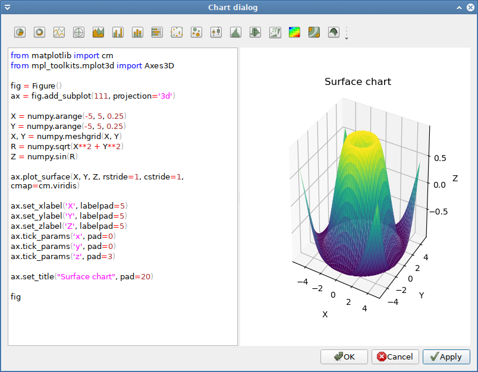

# Macro menu

## Macro → Insert image

The **`Insert bitmap`** option in the Macros menu lets the user choose an image file and creates cell code that represents an image and chooses the image cell renderer.

## Macro → Insert chart

The **`Macros → Insert chart...`** option provides an easy way of generating
matplotlib figures. They generate multi-line code. The last line is an expression that yields a `matplotlib.figure.Figure` object.

The dialog comprises a toolbar with several chart types, an editor on the left and a chart preview on the right side.

Clicking on a chart button inserts code for the respective chart at the current cursor position. The code is meant as template for users, who want to quickly create and edit common chart types. However, any matplotlib chart can be created in the editor.

The preview is updated when pressing the `Apply` button. If an exception occurs of if no Figure object could be retrieved then an error message is displayed.

Pressing the `Ok` button puts the code in the editor in the current cell and activates the matplotlib renderer.

For further reference on how to create charts, the [matplotlib web site](https://matplotlib.org/users/index.html) is recommended.

### Note:

With the upcoming Python 3 version of *pyspread* (i.e. v. 1.99.0+), the chart dialog has been completely rewritten.

For easier transition from previous versions of *pyspread*, the special class `charts.ChartFigure` is provided. This class subclasses the matplotlib Figure class. The subclass takes matplotlib arguments and creates a figure in one step. It is recomended to replace code that uses this class.
